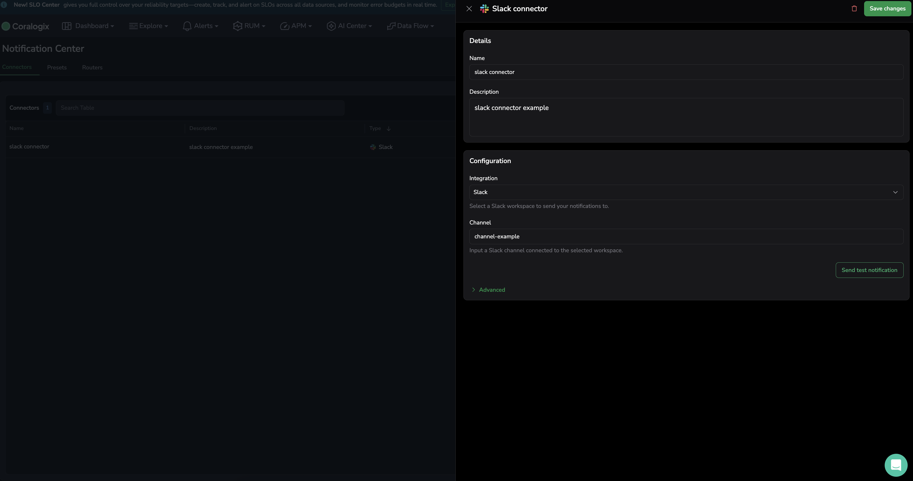
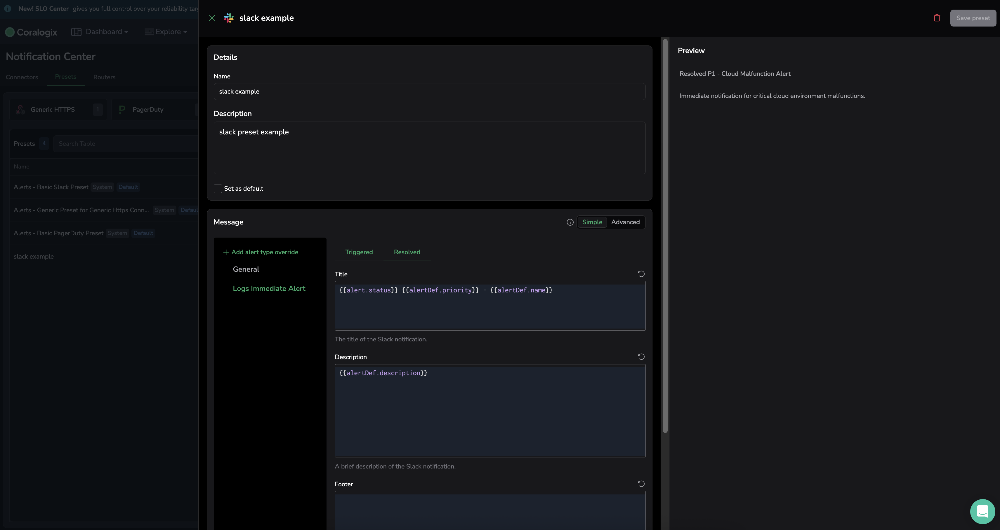
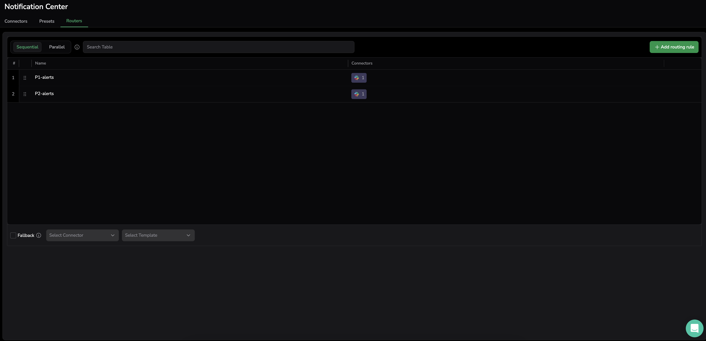

# Managing Coralogix Notification Center with the Terraform Provider

## Overview
This guide walks you through configuring Coralogix Notification Center resources using the Terraform Provider. 
It introduces the core components of the Notification Center and demonstrates how to integrate them into your 
Terraform configurations to control how alerts are formatted, routed, and delivered to external systems.

For more information on the Notification Center, refer to the [official documentation](https://coralogix.com/docs/user-guides/notification-center/introduction/).

## Notification Center Components
Coralogix Notification Center allows you to define and manage how alerts are dispatched to external systems such as 
Slack, PagerDuty, and generic webhooks. 
It offers flexible routing, templating, and integration capabilities through the following resource types:

### Connector
Defines the external destination for notifications. 
Connectors determine where alerts are sent—such as a Slack channel, PagerDuty service, or webhook endpoint.
Current supported connector types include:
- Slack
- PagerDuty
- Generic Webhook

### Preset
Defines the structure and content of the notification message. Coralogix provides system Presets for common use cases,
and allows configuring custom Presets, which inherit from system Presets but can be customized further. 
Just like connectors, presets are tailored for specific platforms like Slack, PagerDuty, and webhooks.

### Global Router
Determines how notifications should be routed to specific connectors and presets based on routing rules. 

Notifications are matched with a router based on matching routing label values. When a router is matched, it evaluates all the routing rules of the router in parallel and sends the notification to the configured notification targets.

### Alerts
Alerts are routed through the Notification Center routers, which applies logic to determine the matching router/s, routing rules and where the notification should be sent. 

## Example: Slack Notification Center Configuration
The following sections demonstrate how to configure a Slack-based notification workflow using all Notification Center components.

### Connector Configuration
The following resource defines a Slack connector with fallback logic and a dynamic override based on the alert's `channel` label:
```hcl
resource "coralogix_connector" "slack_example" {
  name        = "slack connector"
  description = "slack connector example"
  type        = "slack" # The type of connector, in this case, Slack.
  connector_config = {
    fields = [
      {
        field_name = "integrationId"
        value      = "slack-integration-id" # A provided integration ID for the Slack connector.
      },
      {
        field_name = "channel"
        value      = "channel-example" # The primary Slack channel where notifications will be sent to.
      },
      {
        field_name = "fallbackChannel"
        value      = "fallback-channel-example" # The fallback channel to use if the primary channel is not available.
      }
    ]
  }

  config_overrides = [ # Optional overrides for the connector configuration, based on entity type.
    {
      entity_type = "alerts" # The entity type to apply the override for. Allows using alerts schema in the override.
      fields = [
        {
          field_name = "channel" # Override the channel field for alerts.
          template   = "{{alertDef.entityLabels.channel}}" # Use a template to dynamically set the channel based on alert labels.
        }
      ]
    }
  ]
}
```
Running `terraform apply` with the above configuration will create a Connector in Coralogix, as shown in the screenshot below:



---

### Preset Configuration
The following resource defines a Slack preset for formatting messages, with overrides based on the alert subtype:
```hcl
resource "coralogix_preset" "slack_example" {
  name        = "slack example"
  description = "slack preset example"
  connector_type = "slack" # The type of connector this preset is designed for, in this case, Slack.
  entity_type = "alerts" # The entity type for which this preset is applicable.
  parent_id = "preset_system_slack_alerts_basic" # The ID of the parent preset to inherit default configurations.
  config_overrides = [
    # Optional overrides for the preset configuration, based on entity sub type.
    {
      condition_type = {
        match_entity_type_and_sub_type = {
          entity_sub_type = "logsImmediateResolved" # This override applies to alerts of type logsImmediateResolved.
        }
      }
      message_config = {
        fields = [ # Fields to override in the Slack message.
          {
            field_name = "title"
            template   = "{{alert.status}} {{alertDef.priority}} - {{alertDef.name}}"
          },
          {
            field_name = "description"
            template   = "{{alertDef.description}}"
          }
        ]
      }
    }
  ]
}
```
Running `terraform apply` with the above configuration will create a Preset in Coralogix, as shown in the screenshot below:



---

### Global Router Configuration
The following resource defines a Global Router that matches based on routing.environment label and dispatches alerts based on priority:

```hcl
resource "coralogix_global_router" "router_example" {
	id = "prod-environment-router"
  name        = "Production environment router"
  description = "Router for production environment notifications"
  
  matching_routing_labels = {
    routing.environment = "production" # Match alerts with label 'routing.environment:production'
  }
  
  rules = [
    {
      name      = "P1-alerts"
      condition = "alertDef.priority == \"P1\"" # Condition to match P1 alerts.
      targets = [
        {
          connector_id = coralogix_connector.slack_example.id # Slack connector to use for P1 alerts.
          preset_id    = coralogix_preset.slack_example.id # Slack Preset to apply for P1 alerts.
        }
      ]
    },
    {
      name      = "P2-alerts"
      condition = "alertDef.priority == \"P2\"" # Condition to match P2 alerts.
      targets = [
        {
          connector_id = coralogix_connector.slack_example.id # Slack connector to use for P2 alerts.
          preset_id    = "preset_system_slack_alerts_basic" # Slack Preset to apply for P1 alerts.
        }
      ]
    }
  ]
}
```
Running `terraform apply` with the above configuration will create a Global Router in Coralogix, as shown in the screenshot below:



---


### Alert using Global Router Configuration
The following resource defines an Alert that uses Global Routers for routing notifications:

```hcl
resource "coralogix_alert" "example_with_router" {
  depends_on = [coralogix_global_router.router_example]
  name        = "metric_threshold alert"
  description = "metric_threshold alert example with routing"
  
  labels = {
    alert_type = "security"
    routing.group = "teamA" # Routing label to match global routers.
    routing.environment = "production" # Routing label to match global routers.
  }
  
  notification_group = {
    router = {} # Enabling routing to use Global Routers.
  }
  
  type_definition = {
    metric_threshold = {
      metric_filter = {
        promql = "sum(rate(http_requests_total{job=\"api-server\"}[5m])) by (status)"
      }
      rules = [{
        condition = {
          threshold    = 2
          for_over_pct = 10
          of_the_last = "1h15m"
          condition_type = "MORE_THAN_OR_EQUALS"
        }
        override = {
          priority = "P2"
        }
      }]
      missing_values = {
        replace_with_zero = true
      }
    }
  }
}
```
Running `terraform apply` with the above configuration will create an Alert in Coralogix, as shown in the screenshot below:


---

## Conclusion

This guide provided an overview of how to configure Coralogix Notification Center resources using Terraform.
You learned how to create connectors, presets, and global routers, and how to use them in alerts configurations.
