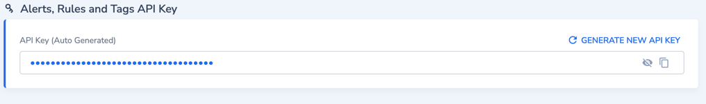

# Coralogix Provider

The Coralogix provider is used to interact with the resources supported by [Coralogix](https://coralogix.com/). The
provider needs to be configured with the proper credentials before it can be used.

## Example Usage

```hcl
terraform {
  required_providers {
    coralogix = {
      version = "<your desired version>"
      source  = "coralogix/coralogix"
    }
  }
}

provider "coralogix" {
  api_key = "<add your api key here or add env variable CORALOGIX_API_KEY>"
  env     = "<add the environment you want to work at or add env variable CORALOGIX_ENV>"
}

resource "coralogix_rules_group" "my_first_rules_group" {
  name = "my first rules_group"
}
```

<!-- schema generated by tfplugindocs -->

## Authentication
For authentication, the Coralogix provider uses an api-key.

The api-key and the desired environment for using the Coralogix provider can be set in two ways:

1. Explicitly:

```hcl
provider "coralogix" {
  api_key = "<add your api key>"
  env     = "<add the environment you want to work at>"
}
```

2. Implicitly through environment variables:

```sh
$ export CORALOGIX_API_KEY="<add your api key>"
```

```sh
$ export CORALOGIX_ENV="<add the environment you want to work at>" 
```  

## Private Domains

For private domain the `domain` field or the environment variables `CORALOGIX_DOMAIN` have to be defined (instead
of `env` or `CORALOGIX_ENV`).

```sh
provider "coralogix" {
  api_key = "<add your api key>"
  domain = "cx.coralogix.com"
}
```

OR

```sh
$ export CORALOGIX_DOMAIN="<add the environment you want to work at>" 
```

## region-domain table:

| Region  | Domain              |
|---------|---------------------|
| APAC1   | app.coralogix.in    |
| APAC2   | coralogixsg.com     |
| EUROPE1 | coralogix.com       |
| EUROPE2 | eu2.coralogix.com   |
| USA1    | coralogix.us        |
| USA2    | cx498.coralogix.com |


## Argument Reference

- `api_key` (String, Sensitive) A key for using coralogix APIs (Auto Generated), appropriate for the defined
  environment. environment variable 'CORALOGIX_API_KEY' can be defined instead.
- `domain` (String) The Coralogix domain. Conflict With 'env'. environment variable 'CORALOGIX_DOMAIN' can be defined
  instead.
- `env` (String) The Coralogix API environment. can be one of ["USA1" "USA2" "APAC1" "APAC2" "EUROPE1" "EUROPE2"]. environment
  variable 'CORALOGIX_ENV' can be defined instead.
